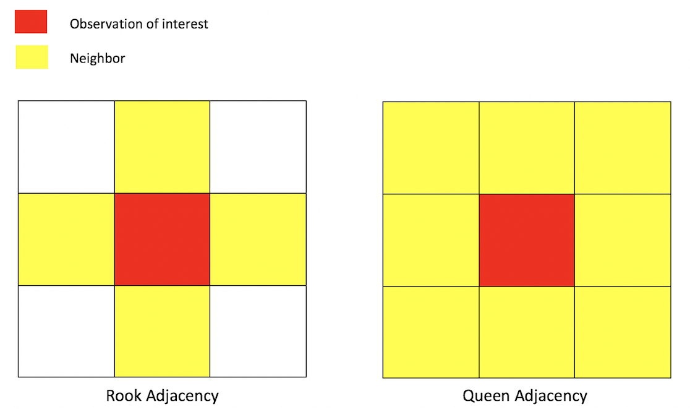
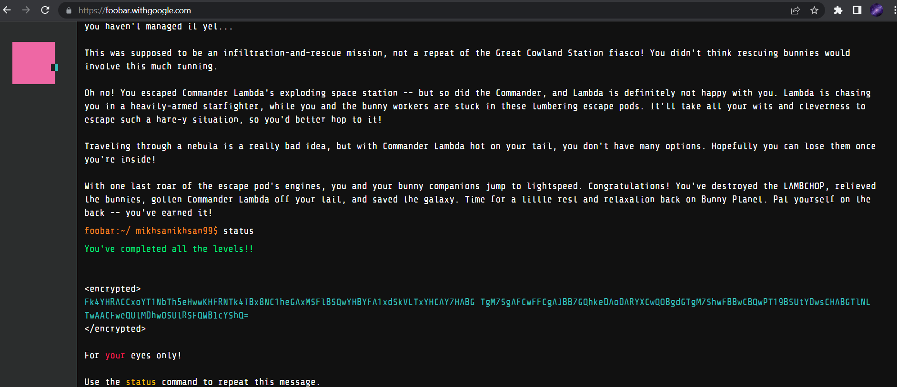

# foo.bar

## About
This repository contains solution for level 1-5 Google foo.bar challenge by Muhammad Ikhsan using Java programming language. The Google foo.bar challenge itself contains several problems related to computer science and its principles in solving real world cases.
For more detail about this challenge can be found in this <a href ="https://towardsdatascience.com/my-google-foobar-journey-2d02e8150158"> link.</a>

## Problem-solving details
The problems consists of 5 different levels that are increasing in difficulty. The details of the challenge elaborated below:
- Problem 1 (level 1) `array accessing` `ad-hoc` `indexing`:  
The easiest problems. The tasks is to convert text into braille code.

- Problem 2 (level 2) `math` `ad-hoc`:  
Math problems (about configuration of pegs) related to linear equations but it can be simplified into `O(1)` algorithm.

- Problem 3 (level 2) `greedy` `big number` `special cases`:  
Greedy approach problem that must be solved with big number library or specialized library for big number computation `> 64 bit integer`.
I used Java programming language, therefore it is more easy because Java offers `java.math.BigInteger` library that can handle big number computations.
For the basic idea, this library treat number like sequences of number, therefore it is array-like data structure that can contain many numbers.
It also consists of specialized cases (corner cases) which have to be considered separately.

- Problem 4 (level 2) `combinatorics` `counting techniques` `dynamic programming`:  
This problem is about counting the combinations using recursive algorithm. In order to speed up the algorithm in terms of time complexity, we have to add cache (memoization) about the state that already visited.

- Problem 5 (level 3) `big number` `ad-hoc`:  
The tasks related to ad-hoc problem that must be solved with big number computation library or algorithm.

- Problem 6 (level 3) `dynamic programming` `matrix adjacency` `counting techniques`:  
The problems related to counting combinations in a map (similar to raster data type), which has 4 direction neighborhood adjacency (top, right, left, down), similar to rook adjacency from picture below:

In order to solve the problem we have to implement dynamic programming, I use bottom-up approach in this problem unlike the problem 4 which use top-down approach.

- Problem 7 (level 4) `math` `ad-hoc`:  
Math problems (about configuration of pegs) related to linear equations but it can be simplified into `O(1)` algorithm.

- Problem 8 (level 4) `math` `ad-hoc`:  
Math problems (about configuration of pegs) related to linear equations but it can be simplified into `O(1)` algorithm.

- Problem 9 (level 5) `math` `ad-hoc`:  
Math problems (about configuration of pegs) related to linear equations but it can be simplified into `O(1)` algorithm.

## Finished State
It is said that Google foo.bar is part of Google hiring recruitment, but unfortunately since 2020, it is not used anymore.
This is the screenshot of final state of the challenge:

*Finished state of the challenge*

